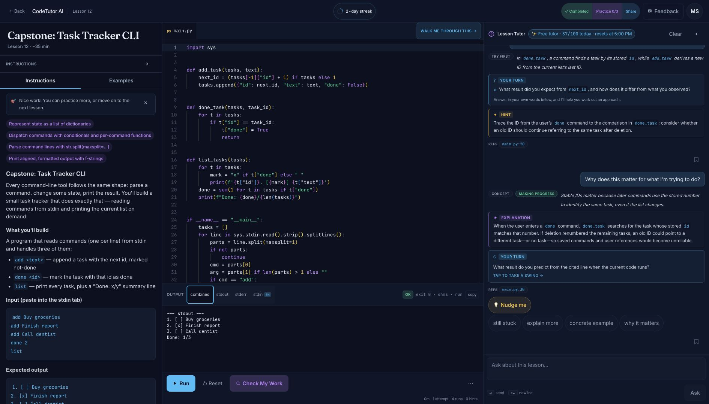
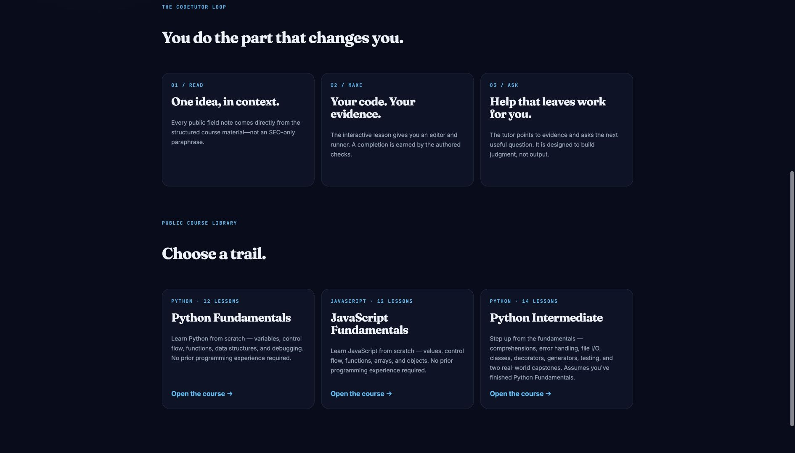
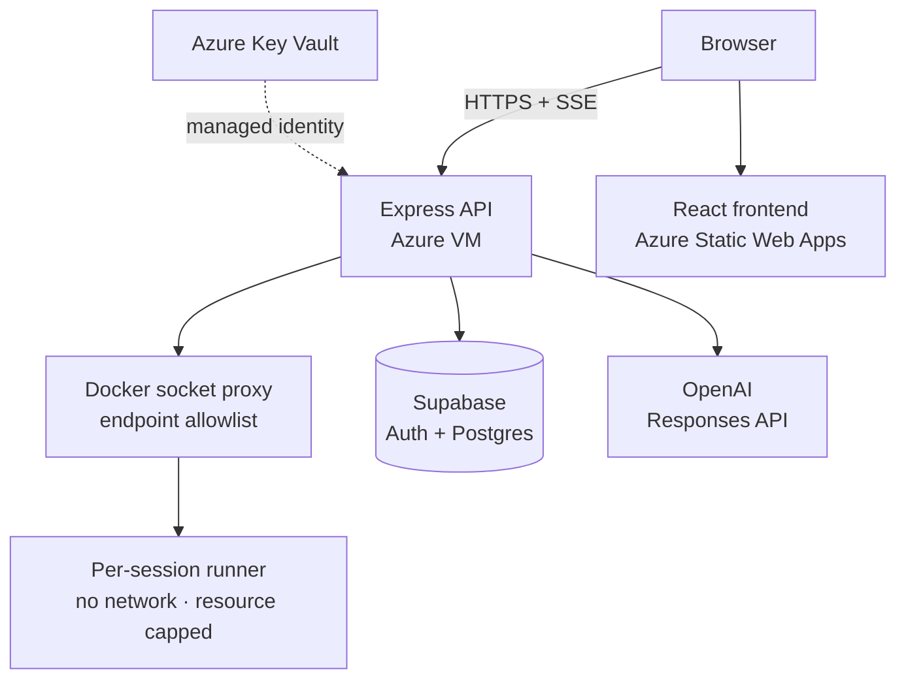

<div align="center">

# CodeTutor AI

**Built to teach, not to autocomplete.**

You write, run, and prove the code. CodeTutor gives the next useful help without taking over.

Hands-on Python and JavaScript courses for beginner-to-intermediate learners, plus a nine-language open coding workspace.

[**Try lesson 1 — no signup →**](https://codetutor.msrivas.com/try/lesson/python-fundamentals/hello-world) &nbsp;·&nbsp;
[Browse 38 public lessons](https://codetutor.msrivas.com/learn-to-code/)

</div>

<p align="center">
  <a href="https://raw.githubusercontent.com/msrivas-7/CodeTutor-AI/refs/heads/main/docs/assets/readme/product-experience.jpg"></a>
  <br />
  <sub><b>Task Tracker CLI capstone</b> — the lesson, the learner's code, real execution, and a contextual engineering discussion in one workspace. Select the image for the full-size view.</sub>
</p>

<div align="center">

[](https://github.com/msrivas-7/CodeTutor-AI/actions/workflows/ci.yml)
[](https://github.com/msrivas-7/CodeTutor-AI/actions/workflows/e2e.yml)


[Architecture](docs/ARCHITECTURE.md) &nbsp;·&nbsp;
[Development](docs/DEVELOPMENT.md) &nbsp;·&nbsp;
[Content authoring](docs/CONTENT_AUTHORING.md)

</div>

## Learning that leaves the work to the learner

Most AI coding tools optimize for reaching an answer. CodeTutor AI optimizes for building the reasoning that produces one.

The learner keeps the keyboard. The tutor can use the current lesson, code, run results, selected lines, and recent attempts to offer an explanation, question, concrete example, or smaller next step. It can help with syntax, debugging, and design trade-offs without quietly doing the exercise for the learner.

### The learning loop

1. **Read** — start with a focused lesson and a concrete outcome.
2. **Make** — write real code in a multi-file Monaco workspace.
3. **Run** — compile or execute it inside an isolated per-session container.
4. **Ask** — get help grounded in the lesson and the code on screen.
5. **Prove** — pass authored checks, then transfer the idea through practice.

## A course, not a prompt collection

<p align="center">
  <a href="https://raw.githubusercontent.com/msrivas-7/CodeTutor-AI/refs/heads/main/docs/assets/readme/course-library.jpg"></a>
  <br />
  <sub><b>Three guided trails</b> — from a first program to intermediate Python and real-world capstones.</sub>
</p>

The public catalog currently includes **three courses, 38 lessons, and 111 practice exercises**:

- **Python Fundamentals** — 12 lessons from first output to two capstone programs.
- **JavaScript Fundamentals** — 12 lessons covering values, control flow, functions, arrays, and objects.
- **Python Intermediate** — 14 lessons spanning comprehensions, files, classes, iterators, decorators, testing, regex, and capstones.

Lessons can combine authored explanations, starter code, stdin, expected output, function tests, source-shape checks, worked examples, and hidden edge cases. The wider catalog adds short practice exercises that change the shape of a problem instead of simply repeating it. Progress, code, practice, and preferences persist to the learner's account.

## A tutor that can discuss the engineering

The tutor can reference relevant lines, react to repeated failures, discuss trade-offs in the learner's implementation, and change the depth of its help as the conversation develops. In the real production exchange above, it connects stable task IDs to how later commands resolve stored IDs, then hands the next prediction back to the learner. Responses share one structured renderer across lesson and editor modes, keeping explanations, examples, references, and next-step questions readable.

## Two ways to build

<table>
<tr>
<td width="52%" valign="top">

### Guided learning

- Structured courses, prerequisites, capstones, and practice
- Context-aware tutor and progressive hints
- Visible examples plus hidden validation
- Progress, streaks, lesson sharing, and cross-device resume
- First-run guidance that introduces the workspace in context

</td>
<td width="48%" valign="top">

### Open editor

- Python, JavaScript, TypeScript, C, C++, Java, Go, Rust, and Ruby
- Multi-file starter projects with Monaco editing
- Compiled and interpreted execution with stdin, stdout, and stderr
- Select code and ask about the exact lines
- Light and dark themes with persisted layout preferences

</td>
</tr>
</table>

## What makes the teaching loop credible

- **Useful AI turns** — tutor contracts favor explanations, concrete examples, and learner-facing next steps over empty Socratic deflection.
- **Context without client trust** — lesson identity, mastery context, quota, and protected state are resolved or verified at server boundaries.
- **Proof before progress** — authored checks establish completion; practice asks the learner to transfer the idea into a different shape.
- **Safe execution** — learner code runs without network access in resource-capped, non-root containers with read-only root filesystems.
- **State that survives real use** — code, progress, tutor saves, shares, preferences, and activity are server-backed and designed for reloads and multiple devices.
- **Public learning surfaces** — crawlable course pages and shareable lesson snapshots explain the product before sign-in.

## Under the hood

The hosted product runs at [codetutor.msrivas.com](https://codetutor.msrivas.com). The frontend is a React application on Azure Static Web Apps; the API, execution control plane, and isolated runner pool live behind Caddy on an Azure VM. Supabase owns authentication and learner data, OpenAI powers the tutor, and Key Vault supplies runtime secrets through managed identity.



| Layer | What ships |
| --- | --- |
| **Frontend** | React, Vite, TypeScript, Tailwind, Monaco, Zustand, React Router, and streamed execution/tutor updates. |
| **Backend** | Node, Express, TypeScript, Supabase token verification, server-owned learner context, quota enforcement, and the OpenAI Responses API. |
| **Execution** | One Docker runner per active session, reached through an allowlisted socket proxy; non-root, no network, read-only rootfs, and CPU/memory/PID limits. |
| **Learning content** | File-based JSON, Markdown, starter projects, golden solutions, concept tags, practice exercises, and Python/JavaScript function-test harnesses. |
| **Infrastructure** | Azure Static Web Apps, Azure VM, Caddy, Key Vault, GHCR, OIDC deployments, health probes, alerts, and backups. |
| **Quality** | Vitest, schema/content validation, golden-solution verification, AI quality gates, and Playwright across critical and exhaustive lanes. |

<details>
<summary><b>Execution and trust boundaries</b></summary>

1. The authenticated browser requests a session from the API.
2. The backend creates a runner through a Docker socket proxy that exposes only the required container, exec, and image endpoints.
3. The project snapshot is written into the session workspace, then compiled or run with explicit resource limits.
4. stdout and stderr stream back to the browser; idle sessions are reaped automatically.
5. Lesson checks run in a language-specific harness. Hidden expectations remain outside the learner subprocess and results return in a signed envelope.

The backend never gives the browser authority over user ownership, tutor quota, canonical lesson context, or hidden test definitions. BYOK OpenAI keys are encrypted at rest and are never returned to the client after storage.

</details>

For the full API surface, data model, sandbox controls, and deployment topology, read [the architecture guide](docs/ARCHITECTURE.md).

## Run it

### Use the hosted product

[Try the first lesson](https://codetutor.msrivas.com/try/lesson/python-fundamentals/hello-world) without installing anything. Sign in with an email link or Google to save progress, continue a course, and use the hosted tutor allowance. Learners can also store their own OpenAI key for additional tutor use; the editor and code runner do not depend on having one.

### Develop locally

CodeTutor AI uses separate frontend, backend, and end-to-end workspaces plus a Docker Compose stack. Local authentication and Postgres use the development Supabase project rather than a local Supabase instance.

```bash
cp .env.example .env
cp frontend/.env.development.example frontend/.env.development.local

(cd frontend && npm install)
(cd backend && npm install)

docker compose up --build
```

The environment contract, hot-reload workflow, test commands, seeded QA users, and troubleshooting notes live in [the development guide](docs/DEVELOPMENT.md). To add or validate courses and practice, see [content authoring](docs/CONTENT_AUTHORING.md).

## Repository map

```text
backend/           Express API, AI policy, execution control, persistence
frontend/          React product and file-based course content
runner-image/      Polyglot, isolated learner-code image
e2e/               Playwright journeys, fixtures, and test selection metadata
infra/azure/       Production infrastructure and deployment scripts
supabase/          Forward-only database migrations and email templates
docs/              Architecture, development, authoring, and quality records
```

---

<div align="center">

Copyright &copy; 2026 Mehul Srivastava. All rights reserved.<br />
Source available for personal viewing and learning under the terms in <a href="LICENSE">LICENSE</a>.

</div>
