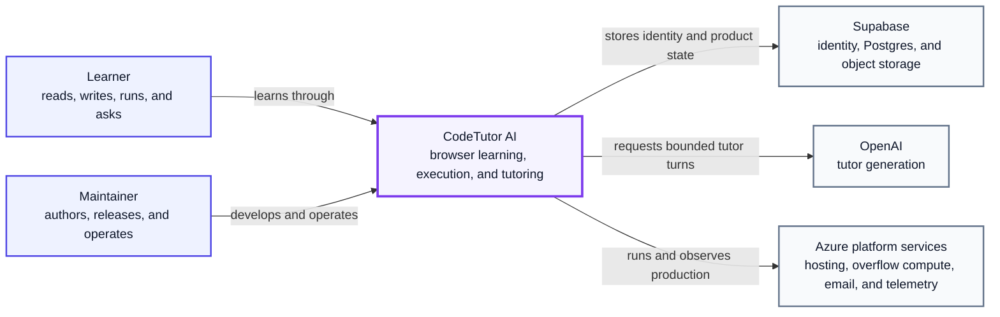
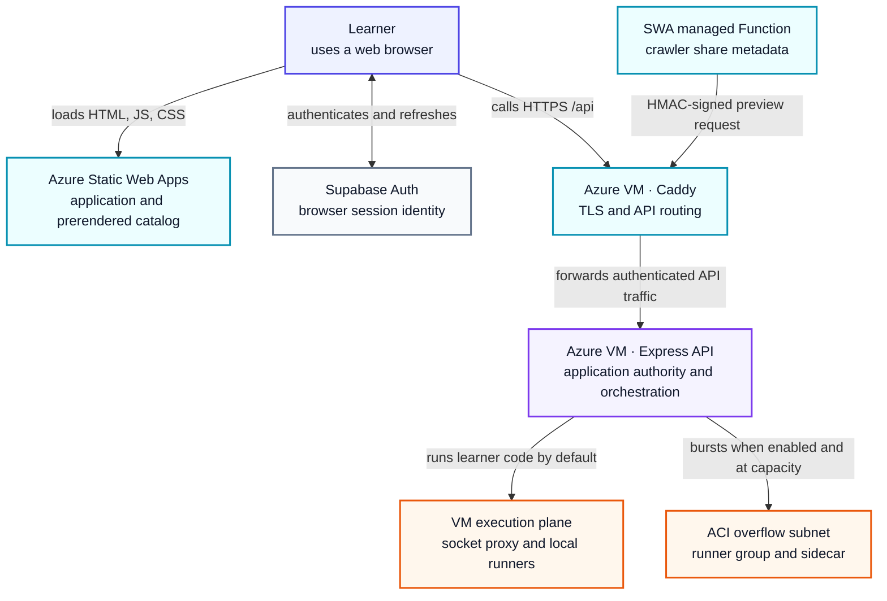
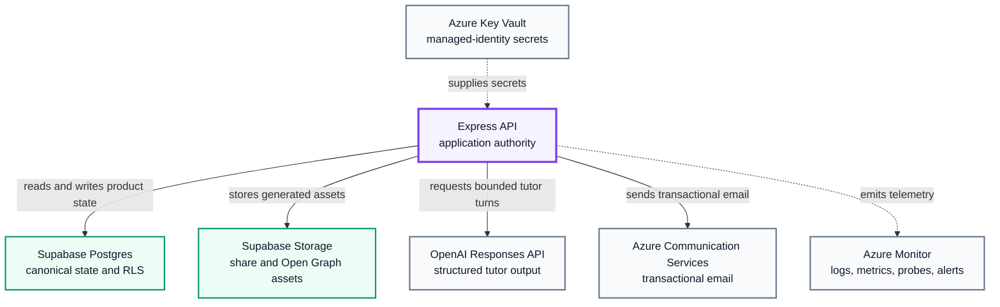
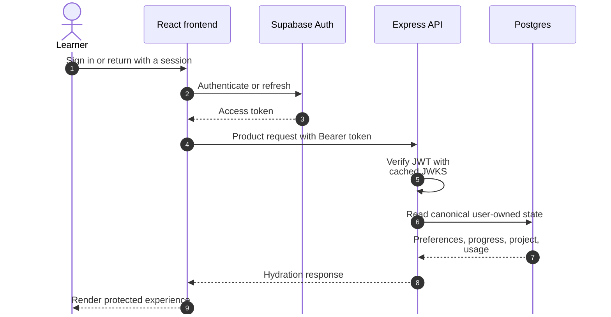
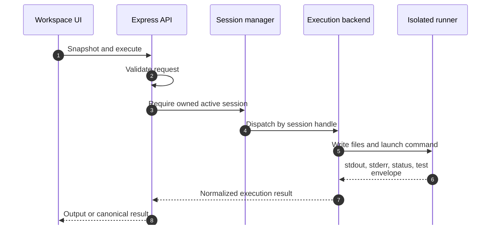
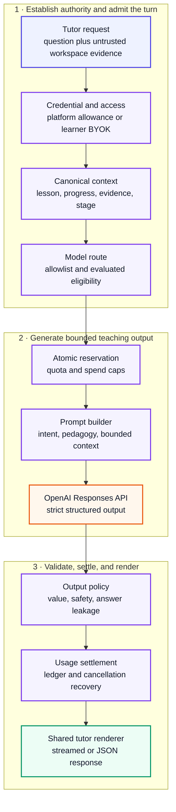
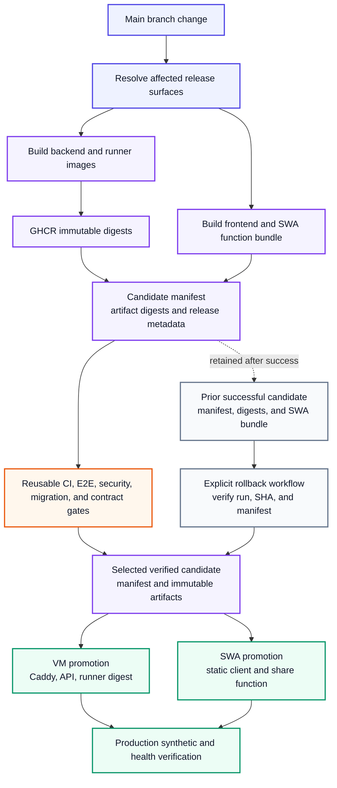

# Architecture

CodeTutor AI is a browser-based learning system, not a thin chat wrapper. A learner reads a lesson, edits and runs real code in an isolated workspace, proves the result against server-owned completion rules, and receives context-aware teaching help without exposing answer keys or trusting browser-supplied progress.

This document explains the current production design and the code that implements it. For local setup and validation commands, see [Development](./DEVELOPMENT.md). For product behavior and screenshots, see the [README](../README.md).

The structure follows industry architecture-description practice without
claiming formal certification. [ISO/IEC/IEEE 42010:2022](https://www.iso.org/standard/74393.html)
informs the separation of stakeholders, concerns, and views;
[arc42](https://docs.arc42.org/home/) informs the selective use of context,
runtime, deployment, cross-cutting, decision, quality, and risk sections; and
[C4](https://c4model.com/diagrams) informs diagram scope and zoom level. The
result starts with a system-context view, opens the production deployment, then
uses focused integration and dynamic views where sequence and trust matter.
Code-level detail stays in the adjacent module map rather than crowding the
picture.

## Stakeholders, concerns, and quality drivers

| Stakeholder | Architectural concerns |
| --- | --- |
| Learners | Fast, understandable feedback; durable progress; accessible and private learning; no leaked answer keys |
| Curriculum and product owners | Canonical lessons and completion; consistent tutoring behavior; safe anonymous-to-account conversion |
| Engineers and content authors | Clear ownership boundaries, reproducible development, stable extension seams, actionable validation |
| Operators and SRE | Bounded spend and capacity, observable failure, safe deployment, rollback, recoverable background work |
| Security and privacy reviewers | Untrusted-browser containment, arbitrary-code isolation, least privilege, auditable data and AI controls |

The design optimizes for these quality drivers, in order:

1. **Learning correctness:** progress, mastery evidence, and completion come
   from canonical server-owned rules.
2. **Execution safety:** arbitrary learner code stays outside the API process
   and inside a resource-bounded, network-disabled runner.
3. **Teaching value:** tutor responses are contextual, useful, bounded, and
   checked for answer leakage before usage is finalized.
4. **State integrity and privacy:** identity, ownership, quota, shares, and
   personal state survive reloads without trusting client assertions.
5. **Operational control:** artifacts, spend, capacity, migrations, failure
   recovery, and rollback remain observable and bounded.
6. **Product experience:** the workspace remains responsive, accessible, and
   coherent across anonymous, authenticated, responsive, and theme states.

## Architecture views and navigation

The diagrams deliberately zoom rather than repeat one overloaded picture. The
first view treats CodeTutor AI as a single system in its environment; the next
opens that boundary into the production topology; focused runtime views then
explain the interactions where ordering, authority, or failure behavior matter.
Simple modules remain in tables and prose instead of receiving decorative
component diagrams.

| View | Scope and intended reader | Question it answers |
| --- | --- | --- |
| System context | One software system; any product or technical reader | Who uses CodeTutor AI, and which external systems does it depend on? |
| Production topology | Deployable applications and compute boundaries; engineers and operators | Where do the web, API, and execution responsibilities run? |
| API integrations | Data, provider, and operational dependencies; backend, security, and operations engineers | Which managed services does the API use beyond identity and execution? |
| Authentication runtime | One protected-request journey; application and security engineers | Where is identity established and verified? |
| Execution runtime | One code-run journey; backend and security engineers | How does untrusted code reach an isolated runner and return safely? |
| Tutor pipeline | One AI-turn journey; product, AI, backend, and finance owners | Where are context, admission, policy, and spend controlled? |
| Release and rollback | One production change; maintainers and operators | How is an exact candidate validated, promoted, verified, and recovered? |

### System context

This is the deliberately small entry diagram. CodeTutor AI is one system here;
the production topology below opens that box.



**Legend:** blue boxes are people, purple is the CodeTutor AI system boundary,
and gray boxes are external software systems or platforms. Every arrow is a
labeled dependency directed from its user to its provider.

### Production topology

Three boundaries shape the system:

1. **The browser is an untrusted learning client.** It owns interaction state and renders the workspace, but it does not authorize access, award completion, set quota, or define canonical lesson context.
2. **The API is the application authority.** It authenticates requests, resolves curriculum and learner state, meters AI usage, manages execution sessions, and persists product data.
3. **Learner code runs outside the API process.** Each active workspace receives an isolated runner. A socket proxy exposes only the Docker operations the session manager needs; optional Azure Container Instances provide bounded overflow capacity.

This deployment view opens the CodeTutor AI system boundary into the actual
production applications and compute planes. The following integration view
separates the API's managed-service dependencies so neither picture becomes a
wall of small boxes.
Arrows describe a request, data, configuration, or telemetry relationship; they
do not imply shared trust.



**Legend:** blue is the learner; cyan is the public edge/ingress; purple is
CodeTutor application authority; orange is isolated execution; and gray is an
external identity system. Solid arrows are runtime request/data paths.

### API integration view

The API is the only product-authority box in this view. Identity and execution
are already covered by the topology; this view names the intent of each data,
provider, and operational dependency without exposing those services directly
to the browser.



**Legend:** purple is CodeTutor application authority, green is managed product
data, and gray is another managed dependency. Solid arrows are runtime calls or
data paths; dashed arrows are configuration or telemetry.

### Production building-block map

| Layer | Owns | Primary implementation |
| --- | --- | --- |
| Web client | Routes, lesson/workspace presentation, Monaco, tutor rendering, optimistic interaction state | [`frontend/src/App.tsx`](../frontend/src/App.tsx), [`frontend/src/api/client.ts`](../frontend/src/api/client.ts), [`frontend/src/state`](../frontend/src/state) |
| Static web edge | SPA/static assets, prerendered catalog and lesson pages, crawler share adapter | [`frontend/vite.config.ts`](../frontend/vite.config.ts), [`swa-api/src/sharePage.js`](../swa-api/src/sharePage.js) |
| Application API | Authentication boundary, canonical state, execution orchestration, AI admission and policy | [`backend/src/index.ts`](../backend/src/index.ts), [`backend/src/routes`](../backend/src/routes) |
| Execution plane | Session ownership, local runner lifecycle, optional ACI overflow, function-test harness | [`backend/src/services/session`](../backend/src/services/session), [`backend/src/services/execution`](../backend/src/services/execution) |
| Data plane | Auth, durable learner/product state, RLS, share assets | [`backend/src/db`](../backend/src/db), [`supabase/migrations`](../supabase/migrations) |
| Delivery and operations | Immutable images, candidate validation, promotion, rollback, telemetry | [`.github/workflows/release.yml`](../.github/workflows/release.yml), [`infra/azure`](../infra/azure), [`docker-compose.prod.yml`](../docker-compose.prod.yml) |

## Constraints and solution strategy

The production shape is constrained intentionally:

- the learning workspace must run in a standard browser with no local toolchain;
- the public application is static-edge hosted while stateful authority remains
  in the API;
- Supabase provides identity, Postgres, and object storage, but product
  authorization still belongs to the API;
- arbitrary code needs Docker-compatible isolation locally and on the VM, with
  Azure Container Instances as optional overflow;
- tutoring depends on the OpenAI Responses API but remains wrapped in
  provider-independent admission, context, output-policy, and settlement
  boundaries; and
- database and release changes must be forward, reviewable, and recoverable.

The strategy follows from those constraints: a React static client, an Express
application authority, server-owned learning state, ephemeral per-session
runners behind an execution abstraction, structured AI output with atomic
reservations, forward Postgres migrations with RLS, and immutable candidate
artifacts promoted through reusable gates.

## Runtime flows

### Authentication and application hydration

Supabase Auth is the identity provider. The browser uses the public Supabase client only for authentication and session refresh. Product reads and writes go through the API, which validates the bearer token and applies its own authorization and ownership rules.



The route and hydration boundary begins in [`frontend/src/App.tsx`](../frontend/src/App.tsx). API calls pass through [`frontend/src/api/client.ts`](../frontend/src/api/client.ts), which attaches the active bearer token, identifies browser mutations, cancels stale requests, and performs one bounded refresh retry. Server authentication and route composition begin in [`backend/src/index.ts`](../backend/src/index.ts).

### Code execution

The browser never talks to Docker or ACI directly. It submits a project snapshot or execution request to the API. The server checks session ownership, resolves the assigned backend handle, validates paths and limits, then executes inside the learner's runner.



The execution abstraction is defined in [`backend/src/services/execution/backends/types.ts`](../backend/src/services/execution/backends/types.ts):

- [`localDocker.ts`](../backend/src/services/execution/backends/localDocker.ts) creates one local runner per active session through the allowlisted socket proxy.
- [`aci.ts`](../backend/src/services/execution/backends/aci.ts) controls Azure Container Instances through managed Azure APIs and the authenticated sidecar.
- [`hybrid.ts`](../backend/src/services/execution/backends/hybrid.ts) keeps work local until configured capacity or operating rules direct overflow to ACI, then dispatches later calls by the stored handle kind.
- [`index.ts`](../backend/src/services/execution/backends/index.ts) always constructs the local backend first. It returns that backend directly when overflow is disabled or incomplete, and otherwise wraps local plus ACI in the hybrid router.

There are therefore two effective runtime shapes: **local-only**, and
**hybrid local plus ACI overflow**. ACI is an implementation inside the hybrid
shape, not a separately selected operating mode. The current factory does not
read `config.executionBackend`; the legacy `EXECUTION_BACKEND` setting remains
in configuration but is not an active routing selector. Treating that setting
as operational control would be incorrect until the code either removes it or
wires and validates it explicitly.

### Guided completion and protected tests

Completion rules are curriculum authority, so the browser does not receive private expected values. Public lesson content supplies presentation and safe rule metadata; protected function-test data lives under [`content/memory-warmups`](../content/memory-warmups) and backend-owned lesson sources.

For `function_tests`, the runner harness:

1. loads expectations into memory and removes the tests file before learner code starts;
2. launches learner code in a child process inside the already isolated runner;
3. emits a sentinel-wrapped result envelope signed with a per-run HMAC nonce; and
4. lets [`runHarness.ts`](../backend/src/services/execution/harness/runHarness.ts) verify the signature with a timing-safe comparison before the API trusts the result.

The JavaScript `vm` context narrows the driver environment but is not treated as the security boundary. The container boundary, process isolation, resource controls, and signed envelope form the trust model.

### Contextual tutor request

Tutor turns combine deterministic admission and output policy with model-generated teaching. The browser may submit code, selection, run output, history, and lesson identifiers, but all of those are untrusted evidence. For guided lessons, the backend resolves canonical course content, learner progress, and teaching stage before building the prompt.



**Legend:** blue is untrusted request evidence, purple is CodeTutor-owned
authority or policy, orange is the external model provider, and green is the
validated response boundary delivered to the learner.

Key modules:

- [`backend/src/routes/ai.ts`](../backend/src/routes/ai.ts) is the request and streaming composition boundary.
- [`canonicalTutorContext.ts`](../backend/src/services/ai/canonicalTutorContext.ts) resolves server-authoritative lesson and learner context.
- [`tutorIntent.ts`](../backend/src/services/ai/tutorIntent.ts), [`tutorProgress.ts`](../backend/src/services/ai/tutorProgress.ts), and the prompt builders turn that context into teaching instructions.
- [`modelRouting.ts`](../backend/src/services/ai/modelRouting.ts) and [`modelRegistry.ts`](../backend/src/services/ai/modelRegistry.ts) control platform model eligibility; BYOK remains a learner-owned credential path with server safety checks.
- [`aiReservations.ts`](../backend/src/db/aiReservations.ts) makes platform admission atomic and reconciles abandoned reservations.
- [`openaiProvider.ts`](../backend/src/services/ai/openaiProvider.ts) calls the Responses API with bounded output and structured schemas.
- [`tutorOutput.ts`](../backend/src/services/ai/tutorOutput.ts) and [`tutorPolicy.ts`](../backend/src/services/ai/tutorPolicy.ts) validate usefulness and safety before visible usage is finalized.
- [`frontend/src/util/useTutorAsk.ts`](../frontend/src/util/useTutorAsk.ts) is the shared client request path; [`TutorResponseViews.tsx`](../frontend/src/components/TutorResponseViews.tsx) is the shared visual renderer.

Only a turn that passes the product's teaching-value contract counts as a visible question. Reservations fail closed under uncertainty, while cancellation and crash reconciliation prevent abandoned work from silently consuming capacity forever.

### Learning state and public shares

Course and lesson progress, editor snapshots, preferences, saved tutor messages, streak history, concept evidence, usage, and public-share ownership are durable server-side state. Frontend stores provide responsive local interaction but reconcile against the API.

Public shares have two read paths:

- A human opens `/s/:token` in the React application and reads through the bounded public API.
- A crawler reaches the managed SWA function, which signs a purpose-bound request to the backend's internal preview endpoint. That path returns metadata without counting a human view and fails closed if the dedicated HMAC configuration is absent.

Share story and Open Graph images live in Supabase Storage. Durable schema and policy truth lives exclusively in ordered forward migrations under [`supabase/migrations`](../supabase/migrations).

## Frontend architecture

The frontend is React, TypeScript, Vite, React Router, Zustand, Monaco, and Tailwind with semantic design tokens.

### Route families

- **Public product:** landing, comparison, privacy, terms, support, login/signup/reset, auth callback, and public share.
- **Anonymous trial:** `/try/lesson/:courseId/:lessonId`; the product boundary limits anonymous learning to the supported first-lesson experience even if a different URL is supplied.
- **Authenticated learning:** start/welcome, free editor, course library, saved tutor messages, course and lesson workspaces.
- **Internal:** development content health and authenticated admin routes, each guarded at the route and server boundary.

### State ownership

| State | Owner |
| --- | --- |
| Authentication session | Supabase client plus the application auth boundary |
| Durable preferences, progress, project, shares, saved messages | API/Postgres; frontend stores cache and reconcile |
| Editor buffers and layout interaction | Project and preference stores, synchronized at explicit persistence boundaries |
| Run lifecycle and output | Run/session stores, backed by server execution sessions |
| Tutor availability and quota presentation | `useAIStatus` cache; backend ledger and reservations remain authoritative |

Course JSON under [`frontend/public/courses`](../frontend/public/courses) is browser-safe curriculum content. Build-time scripts generate the course registry, prerendered public pages, sitemap, and Open Graph assets. Generated registry caches are not authored sources and should not be committed.

## Backend architecture

[`backend/src/index.ts`](../backend/src/index.ts) is the Express composition root. Its order is intentional:

1. CORS, Helmet, JSON parsing, request identifiers, structured logging, and metrics;
2. narrowly scoped public endpoints such as health and email unsubscribe;
3. authenticated session, project, execution, AI, user-data, feedback, and share endpoints;
4. anonymous trial and anonymous-to-account handoff boundaries;
5. admin-only and internal HMAC-protected routes; and
6. not-found and error handling.

Route-specific middleware owns body-size limits, CSRF/mutation checks, rate limits, token verification, admin authorization, and response redaction. The route tree in the composition root is the authoritative API inventory; individual route modules define their schemas and ownership rules.

The server begins listening before asynchronous readiness completes so health reporting can distinguish liveness from readiness. Background services start only after the required dependencies are ready. They include session cleanup, cost and capacity sampling, ACI health and warm-pool control, platform-budget monitoring, email digest processing, orphan-share cleanup, invariant validation, AI-reservation reconciliation, and abandoned-progress repair.

## Data architecture and trust boundaries

The backend uses a privileged server connection where an operation genuinely requires it, including controlled Supabase Auth administration. For user-scoped reads and writes, explicit `user_id` predicates and RLS-context helpers provide defense in depth. The browser receives only the public Supabase URL and publishable key; the service-role key and database credentials are server-only secrets.

Representative durable domains include:

- user preferences, editor projects, course and lesson progress;
- usage ledgers, atomic AI reservations, overrides, deny lists, and audit events;
- saved tutor messages, streaks, streak days, shares, and view telemetry;
- concept ledger, evidence, retrieval, and memory-warmup state;
- system configuration, release/operations state, and evaluation governance.

Server boundaries own authorization, quota, protected curriculum data, mastery evidence, and completion. A client-provided identifier narrows a request; it never proves ownership or truth.

## Security invariants

| Boundary | Invariant |
| --- | --- |
| Browser to API | Bearer identity is verified server-side; mutations use origin/CSRF defenses, bounded bodies, and route-specific rate limits. |
| Learner project paths | Paths are normalized and allowlisted; traversal, protected-file collision, and symlink escape fail closed. |
| Runner isolation | Non-root process, read-only root filesystem, dropped capabilities, `no-new-privileges`, disabled network, PID/CPU/memory/time limits. |
| Docker control | API reaches an allowlisted socket proxy, not a broadly exposed Docker socket. |
| Function tests | Expected values are removed before learner code; results require a per-run HMAC envelope. |
| Tutor context | Browser content is untrusted evidence; canonical lesson/progress context is resolved by the server. |
| Platform AI | Server-controlled model allowlist, atomic admission, per-user/global caps, deny list, and kill switch. |
| BYOK | Keys are encrypted with AES-256-GCM using a server-held master key and are never returned to the browser. |
| Logging | Project, execution, and AI payloads redact to bounded metadata unless an explicit local-only debugging switch is enabled. |
| Secrets | Production secrets are sourced through Key Vault/managed identity and removed from `process.env` after validated configuration is built. |
| Account deletion | Live sessions and user-owned product data are removed before the controlled Supabase Auth admin deletion completes. |

## Observability and operations

The API exposes `/api/health` for readiness and `/api/health/deep` for dependency-aware production probes. `/api/metrics` is loopback-only unless a bearer token is explicitly configured.

Structured logs and metrics feed Azure Monitor, Application Insights, and Log Analytics. The infrastructure defines resource health, CPU, memory, disk, OOM, email-delivery, key-decryption, unhandled-rejection, spend, and availability alerts. Cost controls include bounded log ingestion, resource budgets, platform AI circuit breakers, and ACI daily limits.

## Architecture decisions and trade-offs

These decisions explain the current shape. A decision that needs a longer
history or migration plan belongs in a dedicated ADR; the public-share preview
boundary is documented in
[`ADR_0A_SHARE_PREVIEW_AUTH.md`](./ADR_0A_SHARE_PREVIEW_AUTH.md).

| Decision | Why | Consequence and trade-off |
| --- | --- | --- |
| Treat the browser as untrusted and the API as product authority | Learner state, answer keys, quota, and ownership cannot safely depend on mutable client data | More server round trips and canonical resolvers, in exchange for consistent authorization and progress |
| Give each active coding session an ephemeral isolated runner | Arbitrary learner code must not share the API process or another learner's workspace | Strong containment and cleanup boundaries, with startup and capacity overhead |
| Use local execution first and ACI only as optional hybrid overflow | Local runners are predictable and economical; burst capacity should remain bounded | The VM is the normal capacity ceiling unless both operational and cost gates admit overflow |
| Require structured tutor output plus deterministic policy | Model output must render consistently, teach rather than leak answers, and produce value per charged turn | Additional schemas, policy checks, and eval gates around a nondeterministic provider |
| Reserve platform AI usage atomically before generation | Concurrent requests must not overspend per-user or global allowance | Reservation reconciliation is required after cancellation, timeout, or crash |
| Use ordered forward migrations and RLS defense in depth | Applied database history must remain auditable and user-owned rows need an independent database boundary | App rollbacks cannot reverse schema history; migrations must remain backward compatible or be followed by compensation |
| Promote immutable release candidates by digest and manifest | Validation should cover the exact backend, runner, and web artifacts that reach production | Release metadata and artifact retention become operational dependencies, but rollback is reproducible |

## Risks and technical debt

| Risk or debt | Current control | Remaining concern |
| --- | --- | --- |
| Stateful API and local runner capacity concentrate on one production VM | Health probes, resource alerts, session caps, restart-safe cleanup, and optional ACI overflow | A VM outage or saturation still has a wider blast radius than a horizontally replicated authority plane |
| Supabase, OpenAI, Azure control planes, and ACS are managed dependencies | Timeouts, bounded retries, fail-closed admission, readiness signals, and learner-facing recovery | Regional or provider outages can still degrade auth, tutoring, execution overflow, email, or persistence |
| Tutor behavior is nondeterministic | Structured output, deterministic policy, model allowlist, complete evaluation gate, and usage settlement | Model updates can change teaching tone or quality without a code-shape change |
| Shared development data is a finite integration resource | Isolated E2E identities, cleanup, sharding discipline, and real-database ownership tests | Parallel local and CI activity can still create contention if fixtures bypass isolation rules |
| ACI overflow adds cold-start, networking, and spend variability | Feature flag, runtime switch, capacity cap, daily cost reservation, warm-pool and health controls | It increases operational complexity and is not a substitute for tested local capacity planning |
| `EXECUTION_BACKEND` is configured but not consumed by the factory | Documentation names the two effective shapes and tests exercise the factory | The unused setting can mislead operators until removed or intentionally wired |

## Release architecture

Production promotion validates the exact artifacts that are deployed.



**Legend:** blue is source/scope, purple is an immutable artifact, orange is a
release gate, green is a production action or verification, and gray is retained
rollback evidence or explicit recovery control. Dotted flow is retention; solid
flow selects and promotes a verified candidate.

[`release.yml`](../.github/workflows/release.yml) uses GitHub OIDC for Azure access, builds immutable backend and runner images, creates the SWA candidate, invokes reusable validation workflows against the candidate, verifies database migration state, and promotes only after gates succeed. [`vm-promote-candidate.sh`](../infra/scripts/vm-promote-candidate.sh) and the release manifest contracts preserve rollback information rather than relying on mutable tags.

[`rollback-release.yml`](../.github/workflows/rollback-release.yml) accepts only a
successful prior production release run, its full recorded Git SHA, and an
explicit acknowledgement. It verifies that immutable manifest, promotes its VM
image digests and SWA bundle, then probes deployed identity and readiness.
Rollback does **not** reverse database migrations; forward migrations must stay
compatible with the previous application or be repaired by a new compensating
migration.

## Validation architecture

Quality is layered deliberately:

- **Unit, type, build, content, solution, policy, and contract tests** run in CI across the supported host matrix.
- **Chromium E2E** runs exhaustively in six balanced shards with two workers each; metadata-owned critical coverage also runs as advisory shadow evidence.
- **Firefox and WebKit** run focused core journeys to catch engine-specific behavior without tripling the entire suite.
- **Security scenarios** run in a separate path-gated, scheduled, and reusable workflow.
- **AI teaching changes** use deterministic policy tests plus the complete model evaluation gate; focused cases help iteration but cannot establish model eligibility.
- **Actual-browser UX audits** are mandatory for browser-observable work under the repository harness. Playwright is supporting evidence, not a substitute for experiencing the final flow.

See [Development](./DEVELOPMENT.md#common-validation-commands) and the [agent harness strategy](./AGENT_HARNESS_STRATEGY.md) for the working loop.

## Codebase map

```text
frontend/                 React application, public curriculum, build-time public pages
backend/                  Express API, persistence, tutor policy, session/execution control
content/                  Backend-only protected learning and memory-warmup material
e2e/                      Playwright journeys, fixtures, and security scenarios
swa-api/                  Managed crawler share-metadata adapter
supabase/migrations/      Ordered database and RLS source of truth
infra/                    Azure Bicep, VM bootstrap, promotion, operations scripts
.github/workflows/        CI, E2E, security, production release, synthetic monitoring
scripts/                  Cross-package governance, harness, release, and audit tooling
docs/                     Product, architecture, development, quality, and authoring truth
```

When extending the system, prefer the existing seams: a route module rather than a second server, a registered harness backend rather than inline language branching, a shared tutor renderer rather than per-panel parsing, a forward migration rather than editing history, and an execution-backend implementation rather than leaking infrastructure details into routes.

## Glossary

| Term | Meaning in this system |
| --- | --- |
| ACI | Azure Container Instances, used only as optional overflow inside the hybrid execution shape |
| BYOK | Bring your own OpenAI key; encrypted server-side and distinct from platform-funded usage |
| Canonical context | Lesson, progress, and teaching state resolved from server-owned sources rather than trusted from the browser |
| RLS | Postgres row-level security, used as defense in depth for user-scoped data |
| Runner | Ephemeral isolated container that executes one learner session's project |
| SWA | Azure Static Web Apps, which hosts the web client and the crawler-facing share function |

---

<sub>Copyright &copy; 2026 Mehul Srivastava. All rights reserved. See [LICENSE](../LICENSE).</sub>
